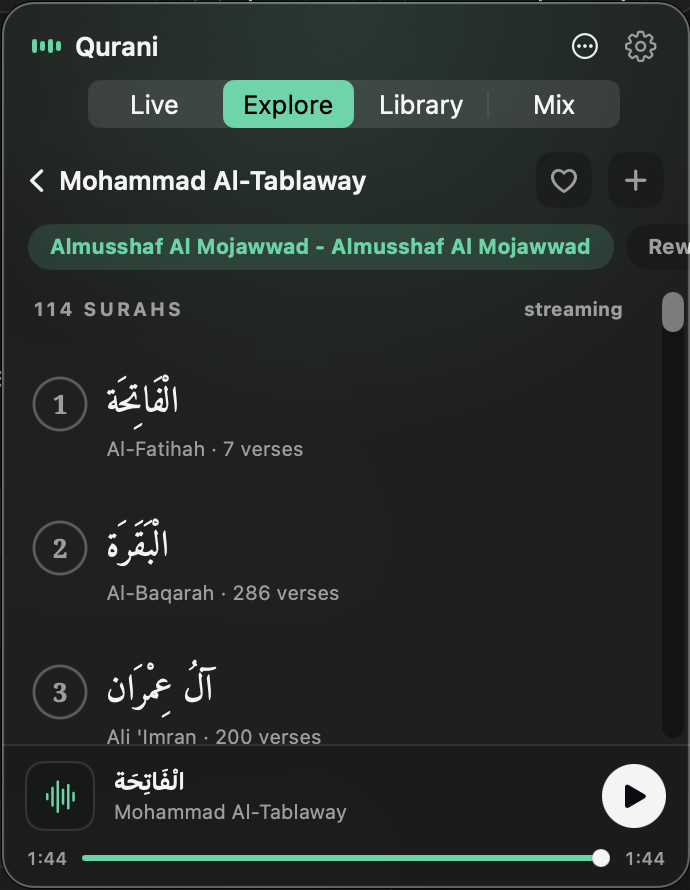

# Qurani

> A minimal, beautiful **macOS menubar app** for listening to the Qur'an — live radio, a 200+ reciter catalog, your own local library, and a signature *random-per-surah* mix. Native SwiftUI, real Liquid Glass, free sources only, tiny footprint.

<p align="center">
  
</p>

## Features

### 🔴 Live Radio
Curated free live feeds — Makkah (Al-Haram), Madinah (An-Nabawi), Egypt Quran Al-Kareem, Saudi Quran Radio — plus **174 always-on per-reciter stations**. Auto-reconnect on drop (3 backoff retries), best-effort surah from stream metadata (never fabricated), and a replayable *recently played* strip.

### 🧭 Explore Reciters
Browse a free **200+ reciter catalog** (mp3quran). Search, filter by riwaya (**Hafs / Warsh / Mujawwad**), pick a moshaf, and **stream any of the 114 surahs instantly**. Favorite a reciter (♡) or add them to your Mix pool (＋).

### 📚 Library
Your personal local pool, grouped **reciter → surah**. Import via `Add files…`, drag-drop onto the panel, or a **watched `~/Music/Qurani` folder**. A **smart tagger** guesses reciter + surah from filename/folder/embedded tags, with a review sheet to fix low-confidence guesses. Security-scoped bookmarks keep access across relaunch.

### 🎲 Mix — Random per-surah station
The signature feature: play a surah range where **each surah is recited by a randomly-chosen qari** from a pool you define (local files + favorited on-demand reciters). In-order or shuffled, full Qur'an / by juz' / custom range. **Re-roll** to regenerate, save as a named preset.

### Plus
- **Themes** — System / Sahar (warm light) / Noor (frosted dark) / Layl (midnight).
- **Media keys & Now Playing** — Control Center + hardware keys via `MPRemoteCommandCenter`.
- **Global hotkey**, **launch at login** (`SMAppService`), animated equalizer menubar icon.
- **Tiny footprint** — single `AVPlayer`, network only on demand, near-zero idle cost.

## Install

**Download the app — easiest.** Grab the latest [**Qurani.dmg**](https://github.com/itwasmee/Qurani/releases/latest), open it, and drag **Qurani** onto **Applications**. The app is unsigned (no paid Apple Developer ID), so on first launch macOS asks once — open **System Settings → Privacy & Security** and click **Open Anyway**.

**One line — skips that step.** Downloads the app, installs it to `/Applications`, and clears the Gatekeeper flag for you:

```sh
curl -fsSL https://itwasmee.github.io/Qurani/get.sh | bash
```

**Build from source.** Needs Xcode 26+ and Swift 6:

```sh
git clone https://github.com/itwasmee/Qurani.git
cd Qurani
./install.sh          # builds Release, installs to /Applications, relaunches
```

Re-run `./install.sh` after `git pull` to update. **Requires** macOS 26 (Tahoe) or newer.

## Tech

Swift 6 · SwiftUI `MenuBarExtra` (agent app, no dock icon) · native Liquid Glass (`.glassEffect`) · `AVPlayer` for streaming + local playback · `KeyboardShortcuts` (the one runtime dependency). Surah metadata is bundled JSON; the mp3quran v3 REST API is hit directly.

## Sources & credits

Free, legal sources only. Reciter catalog and stations from **mp3quran** / **qurango**; fully-vowelized surah names from **Tanzil / QUL**; structure from **quranjson**. Bundled fonts **Amiri Quran** and **Noto Naskh Arabic** (OFL). See [`NOTICE.md`](NOTICE.md) for full attribution and licenses.
